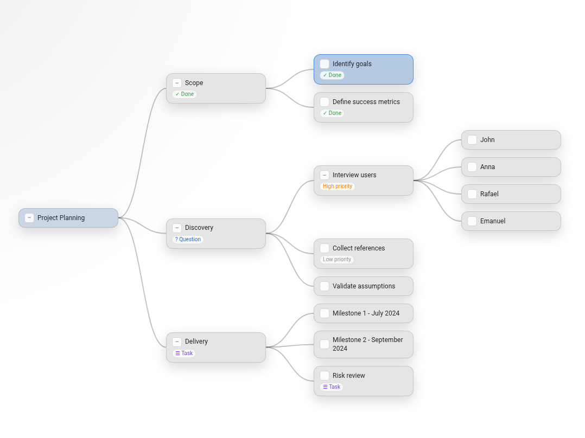

# SwiftMap

SwiftMap is a Visual Studio Code extension for editing tree-structured mind maps in a visual graph editor backed by a plain text `.swiftmap` file format.




The product specification lives in [docs/Design.md](docs/Design.md), and the `.swiftmap` file format is specified in [docs/SwiftMapFormat.md](docs/SwiftMapFormat.md). The repository also includes examples in `examples/` folder.

## Repository Layout

- `docs/` - project specification
- `examples/` - sample `.swiftmap` files
- `vscode-extension/` - extension manifest, implementation, resources, etc.

## Development

Install dependencies:

```bash
npm --prefix vscode-extension install
```

Build the extension:

```bash
npm --prefix vscode-extension run build
```

Run it in VS Code:

1. Open this repository in Visual Studio Code.
2. Press `F5`.
3. In the Extension Development Host window, open one of the files from `examples/` or create a new `.swiftmap` file.

A launch configuration is already provided in `.vscode/launch.json`.

## Packaging

To create a `.vsix` package:

```bash
cd vscode-extension
npx @vscode/vsce package
```

Then install it in VS Code with:

```bash
code --install-extension vscode-extension/swiftmap-0.0.1.vsix
```
